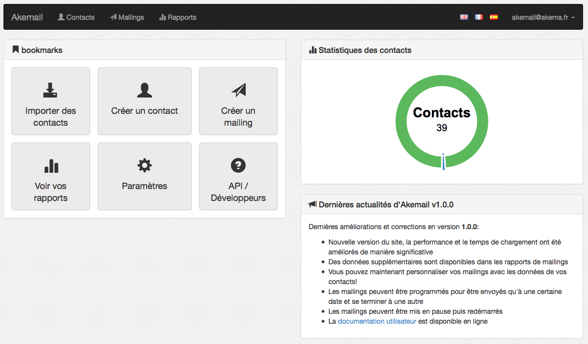
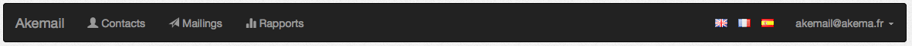

Démarrer avec Akemail
=====================

Ce document va vous expliquer comment commencer avec `Akemail`_

Première connexion
------------------
Lors de votre première connexion, vous arrivez sur le dashboard, centre névralgique de toute l'application `Akemail`_.

Plusieurs panneaux de contrôles sont disponibles, les racourcis (ou **bookmarks**) qui regroupe les boutons des
fonctionnalités les plus utilisées dans Akemail. Le panneau **statistiques des contacts**, qui vous permet d'avoir un
aperçu de la volumétrie de votre base de contact. Le dernier panneau concerne un panneau d'information qui concerne
les **dernières actualités** d'Akemail que vous êtes en train d'utiliser.

Akemail est un logiciel activement développé, et une nouvelle version est disponible toutes les 2 à 4 semaines.
Ce panneau vous montre le numéro de version, et les dernières améliorations et corrections effectuées depuis la dernière
version.

Les différentes pages d'Akemail
-------------------------------
`Akemail`_ se veut simple et intuitif, néanmoins notre logiciel comporte beaucoup de pages. Pour s'y retrouver, voici
comment nous avons organisé les différentes pages d'Akemail. Vous allez rencontrer trois grandes categories de pages.
Les pages qui concernent tout ce qui touche aux **contacts**, à leur gestion. Cela va de l'import des contacts pour importer
vos contacts en grand nombre, à la gestion des listes pour organiser vos contacts, jusqu'au traitement et aux
recherches des contacts dans votre base de données contacts.

Vous avez les pages qui concernent vos **mailings**, la création, la modification et les statiques.

La partie **rapports**, avec les rapports globaux de l'utilisation d'Akemail, les PDF a télécharger, etc..

Et une dernière partie plus personnelle (que l'on a appelé **mon compte**), qui regroupe l'ensemble des informations
sur votre entreprise.

Ses 4 grandes catégories (contacts, mailings, rapports, mon compte) sont accessibles depuis le menu noir situé en haut
de votre écran.

L'espace **mon compte** est disponible en cliquant sur votre email à droite du menu.

.. _Akemail: https://akemail.fr/