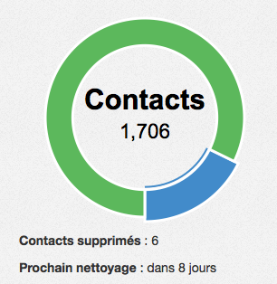

.. _ref-contact_limit:

===================
Limite des contacts
===================

Chaque mois, vous avez le droit à un certain nombre de contact différents. Un contact est identifié de manière unique
par son email. Si vous avez le droit à 2000 contacts durant le mois, alors vous pouvez importer dans votre base de
données de contacts, 2000 emails différents.

Pour éviter les abus, vous ne pouvez pas:

 *  remplir votre base de contacts, faire des mailings, tout supprimer et renvoyer un mailing ensuite avec de nouveaux contacts.

 *  importer plus de contacts que vous n'avez d'emplacements libres

Exemple:

J'ai un plan de 2000 contacts (offre starter).
J'ai un fichier CSV avec 1500 contacts. Je fais l'import de ces 1500 contacts. Il me reste donc 500 contacts
disponibles (2000 - 1500).

Maintenant je supprime 500 contacts. J'ai donc 1000 contacts dans ma base de contacts.
Néanmoins durant le mois en cours, il ne me reste que 500 emplacements de libre.

Ce n'est qu'à partir du début du mois prochain, que mon nombre de contacts disponibles repassera à 1000.
**Mon quota est remis à zéro au début de chaque mois**.

Depuis la page **mon compte**, vous pouvez voir le nombre de contacts supprimés et quand le nettoyage sera effectué:

**Un contact supprimé, puis réimporté durant un mois ne compte que pour un contact.**