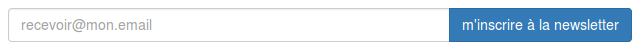
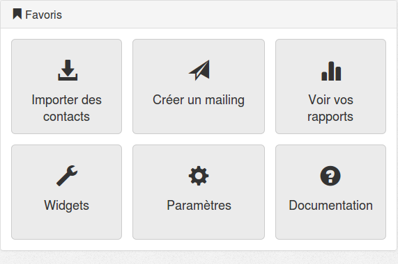
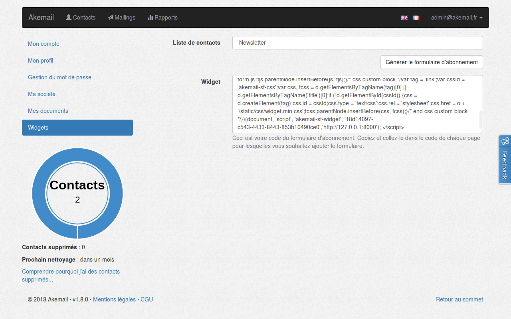

.. _ref-create-and-manage-widgets:

=================================
Gestion des widgets d'inscription
=================================

Principe
--------

Akemail permet de créer des wigdets pour faciliter l'inscription à une liste de mailing donnée.
Ce comportement est à rapprocher des widgets d'inscription aux newsletters présent sur de nombreux sites d'actualités.

Voici les étapes à accomplir pour utiliser un widget sur votre site:

* **créer une liste** ;
* **générer le code** du widget pour cette liste ;
* **copier le code** du widget et placez le sur votre site.

Accéder aux widgets
-------------------

L'interface de création de widgets est accessible :

1. depuis votre *page d'acceuil* dans le bloc ``Favoris`` ;
2. ou par le *menu utilisateur* puis ``Mon Compte | Widget``.

Créer un widget
-------------------

Pré-requis
    Il vous faudra **une liste** pour pouvoir générer le code du widget à
    rajouter dans votre site.

Comment faire?
    1. *sélectionner la liste* à laquelle les contacts seront rajoutés ;
    2. cliquer sur le bouton ``Générer le formulaire d'abonnement`` ;
    3. *copier* le code générer.

Insérer un widget
-------------------

Une fois le code du widget générer il ne vous reste plus qu'à le **coller dans le HTML** de votre site.
Et voici le résultat :

Pré-requis `HTML`
    On considère que le widget est ajouté dans un document ``HTML`` *viable*, c.-à-d. qu'il possède **au moins un élément** ``<titre>`` **ou** ``<link>``.
    Nous utilisons cet élément comme référence pour insérer le ``CSS`` du widget dans le document.
    Si aucun des deux éléments n'est trouvé alors le CSS ne pourra pas être injecté, le formulaire utilisera les styles par défaut du navigateur.