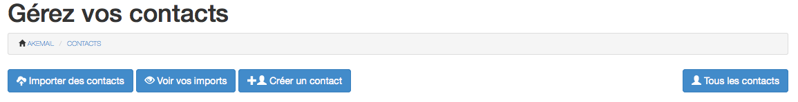
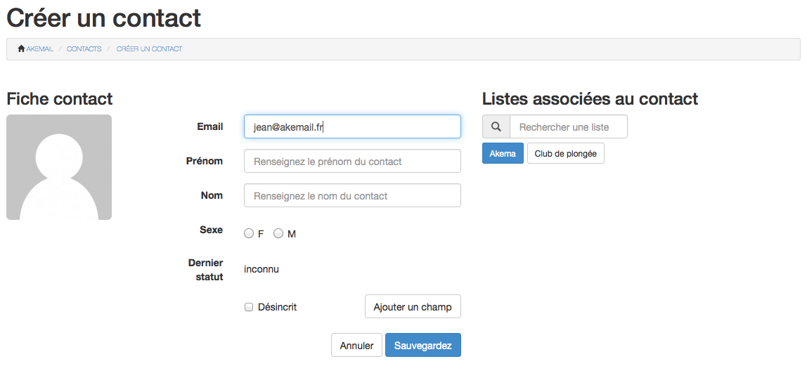
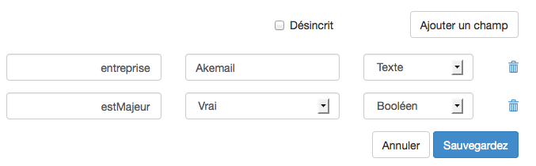

.. _ref-create_contact:

================
Créer un contact
================

Vous pouvez créer un contact dans Akemail en cliquant sur le bouton **créer un contact** depuis le Dashboard:

.. figure::  _static/images/bookmark.png
   :align:   center

ou depuis la page **contacts** accessible depuis le menu principal:

Vous arrivez sur un formulaire de création d'un contact

Cette page regroupe les informations principales de votre contact, comme son nom, son prénom, etc..
Vous pouvez choisir dans quelle liste vous voulez mettre votre contact. Dans mon exemple je vais créer un contact
avec un email jean@akemail.fr et je vais l'ajouter à ma liste Akema (précédement créée).

J'ai la possibilité de rajouter des champs personnalisés. Un champ personnalisé correspond à une information que vous
jugez pertinente. Quelle quelle soit !
Vous pouvez par exemple rajouter un champ entreprise, ou une variable estMajeur :

Pour que les informations soit prises en compte, vous pouvez cliquer sur le bouton sauvegarder.