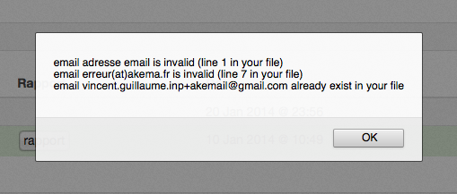

Gérer mes contacts
==================

Créer un contact
----------------

Vous pouvez créer un contact dans `Akemail`_ en cliquant sur le bouton créer un contact depuis le Dashboard:

.. figure::  _static/images/bookmark.png
   :align:   center

ou depuis la page **contacts** accessible depuis le menu principal:

Vous arrivez sur un formulaire de création d'un contact

Cette page regroupe les informations principales de votre contact, comme son nom, son prénom, etc..
Vous pouvez choisir dans quelle liste vous voulez mettre votre contact. Dans mon exemple je vais créer un contact
avec un email jean@akemail.fr et je vais l'ajouter à ma liste Akema (précédement créée).

J'ai la possibilité de rajouter des champs personnalisés. Un champ personnalisé correspond à une information que vous
jugez pertinente. Quelle quelle soit !
Vous pouvez par exemple rajouter un champ entreprise, ou une variable estMajeur :

.. figure::  _static/images/custom_fields.png
   :align:   center

Pour que les informations soit prises en compte, vous pouvez cliquer sur le bouton sauvegarder.

Importer des contacts
---------------------

Vous pouvez créer un contact dans `Akemail`_ en cliquant sur le bouton créer un contact depuis le Dashboard:

.. figure::  _static/images/bookmark.png
   :align:   center

ou depuis la page **contacts** accessible depuis le menu principal:

L'import de contact se fait en trois étapes:

 *  La selection d'un fichier **CSV**
 *  le renseignement des en-têtes
 *  la destination des contacts fraichement créés

Un fichier **CSV** (Comma-separated values) est un format informatique ouvert représentant des données tabulaires sous
forme de valeurs séparées par des virgules.
Excel, libre Office, Google Document, tous permettent d'exporter vos données au format CSV.

Les en-têtes correspondent aux noms des colonnes de votre fichier **CSV**. Ils deviendront des champs personnalisés
pour chaque contact (comme décrits plus haut).

Si durant cette étape, le nombre de colonnes affichées ne correspond pas au nombre de colonnes souhaitées, alors
 votre fichier **CSV** n'est pas valide. Arrétez vous là, modifier votre fichier **CSV** et reprenez un import à zéro.

.. figure::  _static/images/headers.png
   :align:   center

Terminez votre import en selectionnant la destination de vos contacts puis cliquez sur le bouton
**Importer vos contacts**

Import en cours/terminés
------------------------

Un import de contacts est une tache qui peut prendre du temps. Cette tache est effectuée en tache de fond, vous pouvez
pendant un import utiliser Akemail.

La liste des imports que vous avez effectués est disponible dans Akemail depuis le sous-menu dans la page **contacts**

.. figure::  _static/images/imports.png
   :align:   center

Un import passe de l'état EN PREPARATION à l'état PRÊT, puis EN COURS, puis ERREUR ou TERMINÉ

Un rapport d'import est disponible en cliquant sur import.

Il donne des informations sur les erreurs de votre fichier: les doublons, les emails invalides, les lignes ignorées et
précise pour chacune des erreurs la ligne à laquelle l'erreur s'est produite.

 *  Un email n'est inséré qu'une seule fois
 *  Un email invalide n'est pas inséré
 *  Une ligne sans email est ignorée (comme l'entête de votre fichier si elle se trouve au debut de votre fichier **CSV**)

Un import de contacts, peut rester à l'état PRÊT quelques heures. Il correspond à un import de contact pour lequel vous
avez importé un fichier puis abandonné l'opération

.. _Akemail: https://akemail.fr/
