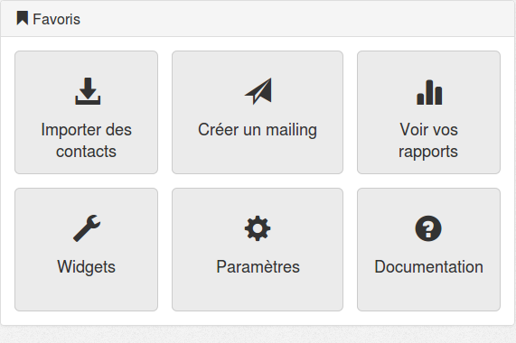

.. _ref-create_mailing:

================
Créer un mailing
================

Information du mailing
----------------------

Vous pouvez créer un contact dans Akemail en cliquant sur le bouton **créer un mailing** depuis le Dashboard:

ou depuis la page **mailings** accessible depuis le menu principal:

Un mailing est un envoi d'email dans le but de promouvoir une information (Synonyme publipostage électronique).

Un mailing comporte différentes informations. Il est conseillé de donner un nom explicite à votre mailing. Cela vous
permettra de le rechercher plus facilement par la suite. Le nom du mailing est privé, vos clients ne voient pas son
intitulé.

Quand vous créer un mailing, vous avez besoin de renseigner un email d'envoi. Il correspond à l'email "expediteur".

**/!\\ Attention un bon email d'envoi, doit correspondre à un email vous appartenant, et dont le nom de domaine n'enfreint pas la norme de vérification** `SPF`_

Exemple:

 * **administrateur@ebay.com** ne fonctionnera pas, nos serveurs n'ont pas le droit d'envoyer ce genre de mailing.
 * **contact@gmail.com** fonctionnera mal, il n'est pas recommandé d'envoyer un email depuis un autre serveur que ceux de gmail. Votre mailing sera très souvent considéré comme un spam.

Préconisez des emails d'envoi comme **contact@monentreprise.com** ou **no-reply@monentreprise.com**

.. _SPF: http://fr.wikipedia.org/wiki/Sender_Policy_Framework

Renseignez votre nom et passez à l'étape 2 en cliquant sur **Sauvegardez et importez votre template**

Import du template et test
--------------------------

L'étape 2 concerne la réalisation du contenu de votre mailing.
Vous devez choisir un sujet pour votre email puis importer un template d'email, qui correspond au code HTML d'un mailing.
Pour obtenir plus d'information sur le template d'un email, vous pouvez lire :doc:`template_mailing`.

Vous pouvez vous envoyer un email de test, pas de panique, aucun contact n'a pour l'instant été selectionné. Il n'est
donc pas possible d'envoyer un mauvais mailing à toute votre base de contact.

L'email de test vous convient ? Vous pouvez passer à l'étape 3 en cliquant sur le bouton **sauvegardez et choissez vos destinataires**

Choisissez vos destinataires et démarrez
----------------------------------------
C'est la dernière étape avant l'envoi d'un mailing:

Durant cette étape vous devez selectionner une liste précédement créée. Si vous n'avez pas renseigné de date et que vous
démarrez votre mailing, le mailing partira tout de suite.

Vous pouvez différer l'envoi d'un mailing à plus tard, et spécifier une date de fin. N'envoyer pas votre offre promotionnelle
à vos clients pour un salon, une fois la date du salon dépassée.

Vous pouvez sauvegarder ce mailing, pour l'éditer par la suite.
Un aperçu est disponible, il représente l'email vu par vos clients dans leur client mail (outlook, gmail)