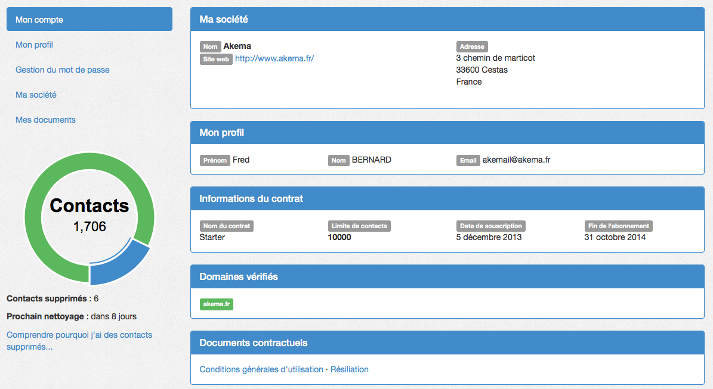

Gérer vos informations personnelles
===================================

Espace Mon compte
-----------------

L'ensemble des informations personnelles vous concernant sont disponibles depuis l'espace **mon compte** sur `Akemail`_

vous accédez à l'espace **mon compte**

L'espace mon compte vous permet de gérer le changement de votre mot de passe.
/!\ Il est conseillé de changer son **mot de passe** dès la première utilisation d'Akemail.

Il vous permet de modifier les différentes informations concernant votre société. Vous pouvez voir l'ensemble de vos
documents, comme vos **factures**, vos rapports mensuels d'activité, etc...

.. _Akemail: https://akemail.fr/